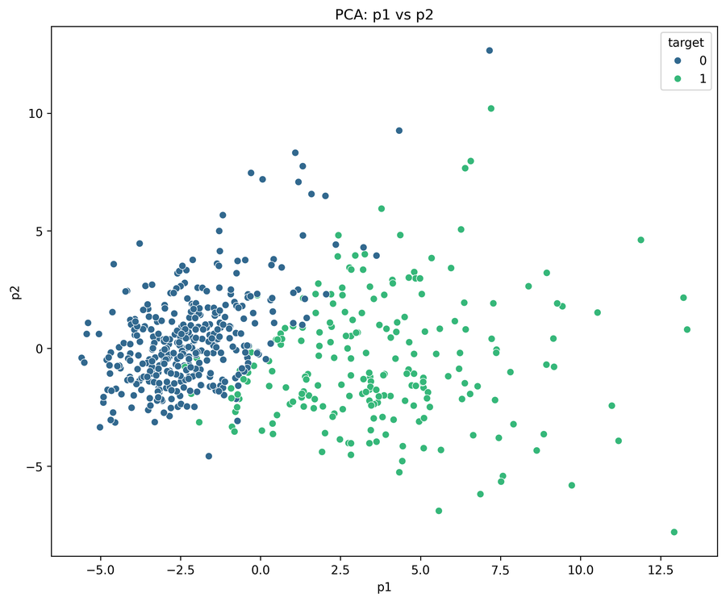
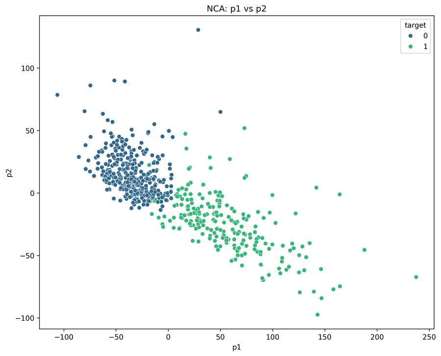
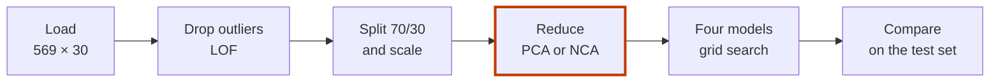

# Breast Cancer Classification (PRT565)

[](https://www.python.org/)
[](https://scikit-learn.org/)
[](LICENSE)

**Four classic classifiers tell malignant from benign breast tumours using 30 cell measurements, with and without PCA and NCA.**

| PCA: two components, no labels used | NCA: two components learned from the labels |
|---|---|
|  |  |

*The 568 samples left after outlier removal, squeezed to two dimensions. 0 = benign, 1 = malignant. From `Breast Cancer/plots/`.*

A doctor takes a fine-needle sample from a breast lump. A lab image of it gives 30 numbers about the cell nuclei: radius, texture, area and more.
Is the lump malignant or benign? The script learns the answer from 569 past cases.
NCA turns the 30 numbers into two that split the classes best. On that view, a decision tree gets 170 of 171 test cases right.

- **What it does:** compares logistic regression, a decision tree, a random forest and k-nearest neighbours, on the original features and after PCA or NCA.
- **How it is measured:** a 70/30 train-test split, 5-fold grid search, and accuracy, precision, recall, F1 and ROC AUC on the test set.
- **What to keep in mind:** NCA and PCA are fitted on all rows before the split, so their scores are optimistic (see Limits).

Assessment 2 for PRT565 Machine Learning and Artificial Intelligence, Charles Darwin University, August 2025. Individual work.
The full write-up is the [report (PDF)](PRT565%20Assessment%202%20S382893.pdf).

## Quick start

Nothing to install to see the results: all 25 charts are in [`Breast Cancer/plots/`](Breast%20Cancer/plots/) and the numbers are in the report.

To run it yourself:

```bash
git clone https://github.com/Estaed/PRT565-Machine-learning.git
cd "PRT565-Machine-learning/Breast Cancer"
pip install pandas numpy matplotlib seaborn scikit-learn
python Cancer.py
```

Run it from the `Breast Cancer` folder: it reads `cancer.csv` and writes the charts to `plots/`.
The report suggests running the `# %%` cells one at a time (for example in VS Code or Spyder), since every chart opens a window.

## How it works



1. **Load.** The Wisconsin Diagnostic Breast Cancer data: 569 samples, 30 features, 212 malignant and 357 benign.
2. **Explore.** Correlations, feature distributions and a pair plot of the features most correlated with the diagnosis (|r| > 0.75).
3. **Drop outliers.** Local Outlier Factor with a threshold of −2.5 removes 1 sample.
4. **Split and scale.** 70% training, 30% test (`random_state=42`), then `StandardScaler`.
5. **Train.** Each model on the original features, on 2 PCA components and on 2 NCA components. Grid search with 5-fold cross-validation picks the settings.
6. **Compare.** Confusion matrices, ROC curves, learning curves and a comparison table.

<details>
<summary><b>Results</b> (accuracy on the 171 test samples)</summary>

**Original features, first fit before tuning** (from `plots/model_comparison_metrics.png`):

| Model | Accuracy | Precision | Recall | F1 | AUC |
|---|---|---|---|---|---|
| Logistic regression | 0.982 | 0.984 | 0.968 | 0.976 | 0.996 |
| Random forest (100 trees) | 0.971 | 0.967 | 0.952 | 0.959 | 0.996 |
| KNN (k = 2) | 0.953 | 0.982 | 0.887 | 0.932 | 0.968 |
| Decision tree | 0.924 | 0.889 | 0.903 | 0.896 | 0.920 |

**Best results with NCA** (from the report):

| Model | Accuracy |
|---|---|
| Decision tree + NCA | 99.42% (170 of 171) |
| KNN + NCA | 99.42% |
| Random forest + NCA | 98.83% |
| Logistic regression, original features | 98.25% |

- In every model, NCA scored higher than PCA. NCA uses the labels; PCA keeps variance and ignores them.
- For logistic regression, the grid search over polynomial degrees 1–3 chose degree 2.
- The report gives cross-validation standard deviations mostly below 0.02.
- It names texture, perimeter and area features as the strongest predictors.

</details>

<details>
<summary><b>Models and their search grids</b></summary>

| Model | Grid (5-fold `GridSearchCV`) |
|---|---|
| Logistic regression | `C` 0.001–100, `l1` or `l2` penalty, `liblinear`; polynomial degree 1, 2 or 3 |
| Decision tree | `max_depth` 3, 5, 7, 10 or none; `min_samples_split`; `min_samples_leaf`; gini or entropy |
| Random forest | `n_estimators` 50, 100 or 200; `max_depth`; `min_samples_split`; `min_samples_leaf`; plus an out-of-bag score |
| KNN | `k` from 1 to 30, uniform or distance weights (10-fold) |

The script also computes information gain by hand for the first five features, and draws the top three levels of the decision tree.

</details>

<details>
<summary><b>Limits</b></summary>

- **NCA and PCA see the test rows.** Both are fitted on all 568 rows, and NCA also uses their labels, before the 70/30 split. The NCA scores above are therefore optimistic.
- **Outlier removal** also runs on all rows before the split.
- **One small, well-known dataset.** 569 cases from one source. These scores do not show how a model would do in a clinic.

</details>

<details>
<summary><b>Files in this repository</b></summary>

| Path | What it is |
|---|---|
| `Breast Cancer/Cancer.py` | The whole analysis, in `# %%` cells |
| `Breast Cancer/cancer.csv` | Wisconsin Diagnostic Breast Cancer data (569 rows) |
| `Breast Cancer/plots/` | 25 charts: distributions, correlations, outliers, PCA, NCA, confusion matrices, ROC and learning curves |
| `PRT565 Assessment 2 S382893.pdf` | The report |

Data: UCI Machine Learning Repository, Breast Cancer Wisconsin (Diagnostic), Wolberg et al. (1995), via Kaggle.

</details>

## Licence

[MIT](LICENSE).
